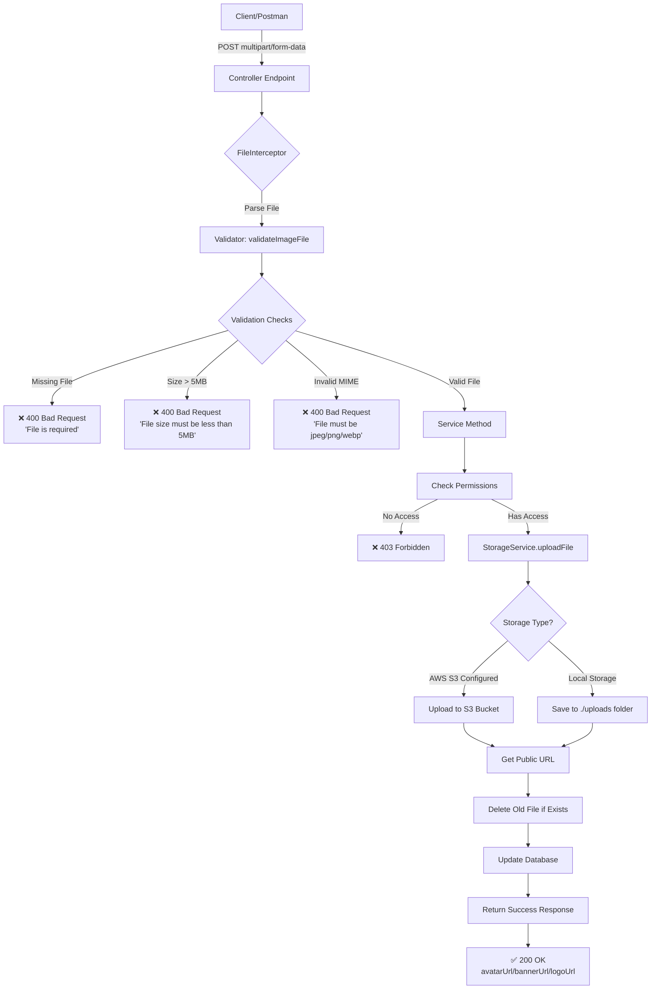
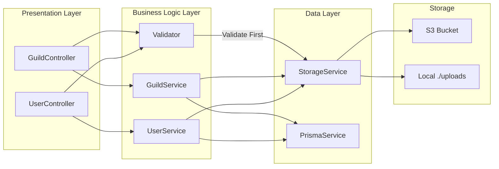
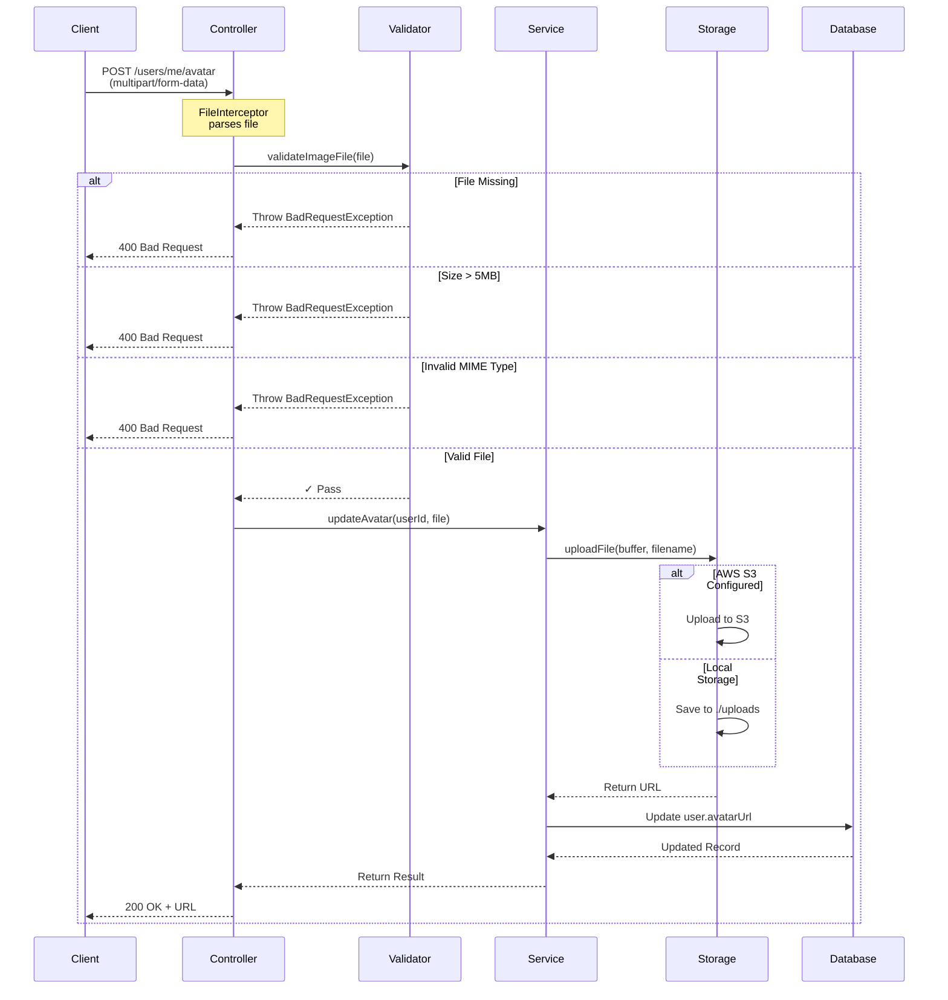
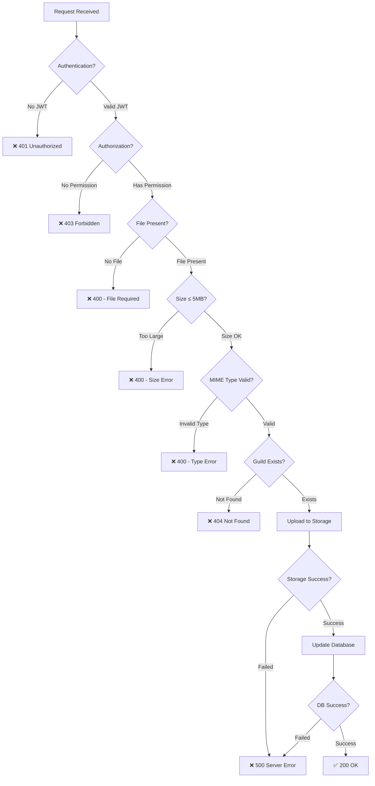
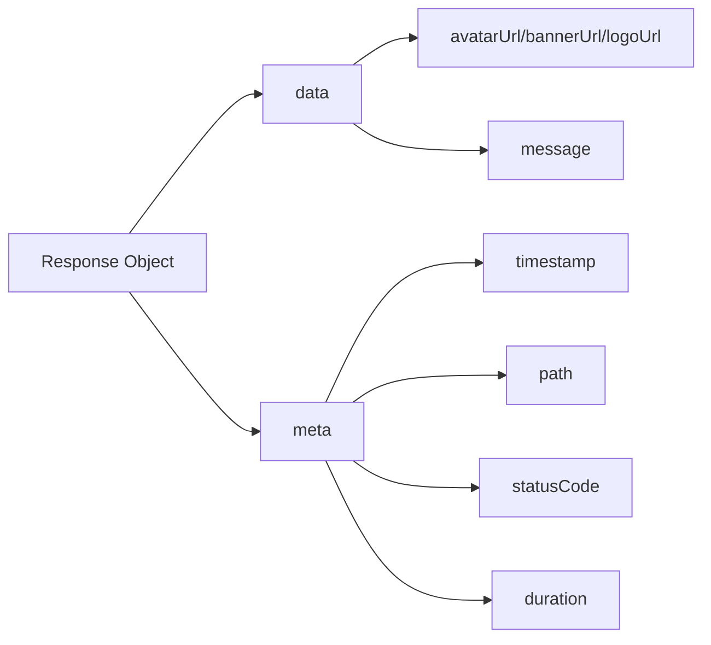
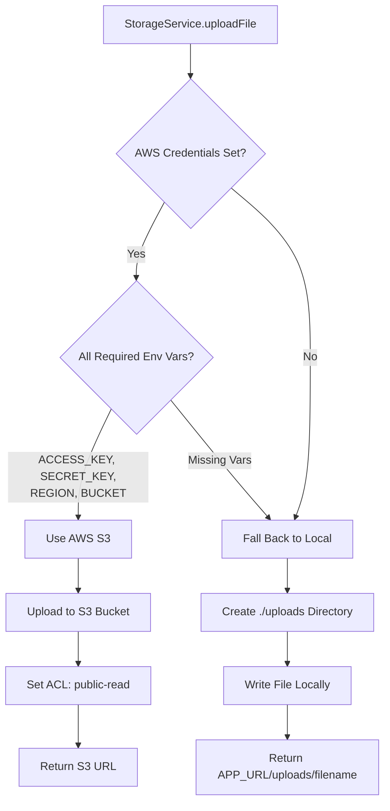
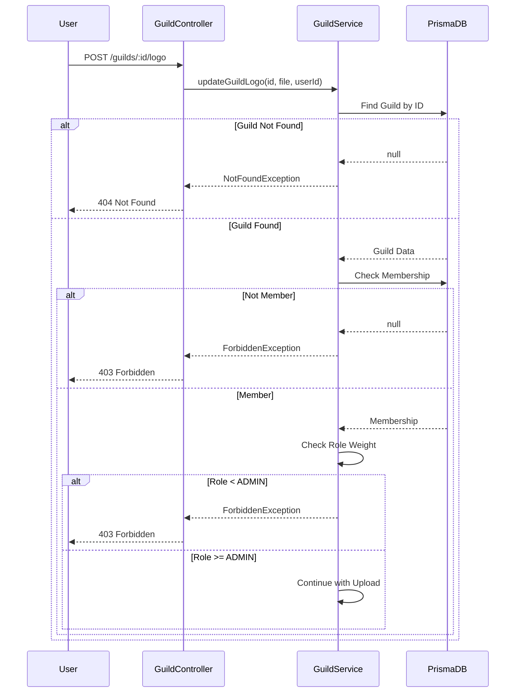
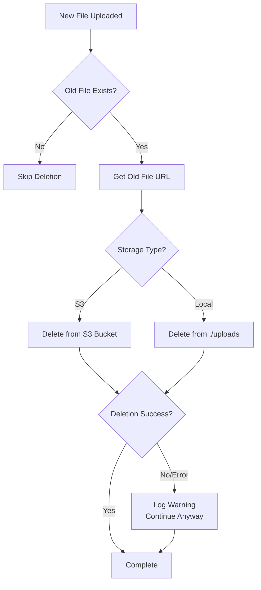
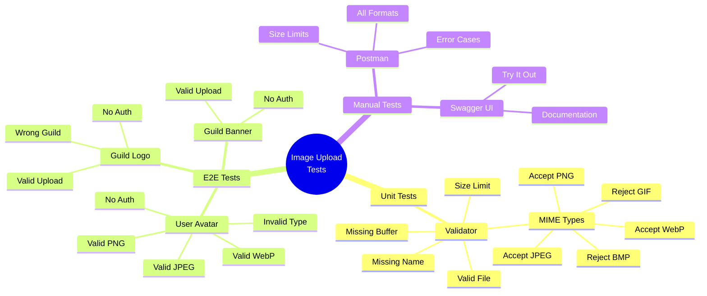
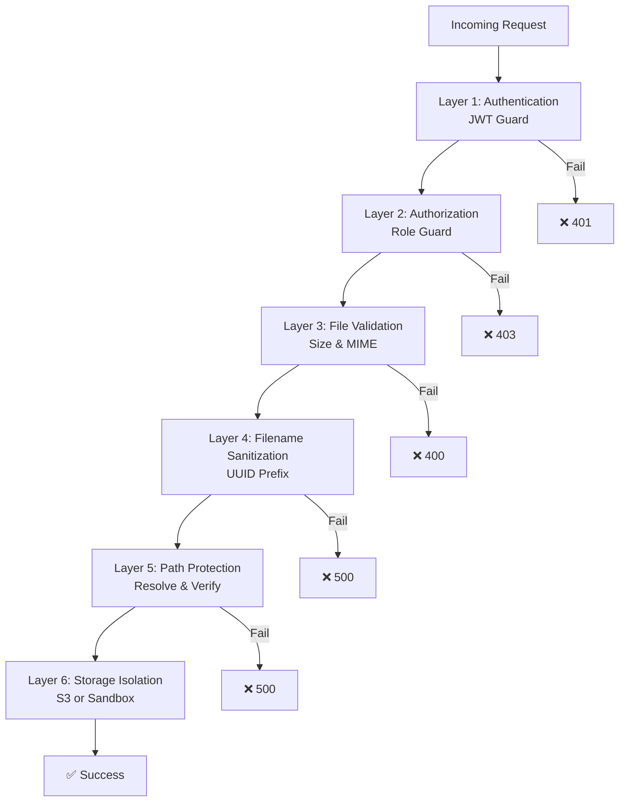

# Image Upload Flow Diagram

## Complete Request Flow

## Component Architecture

## Validation Flow Detail

## Error Handling Flow

## Success Response Structure

## File Storage Decision Tree

## Authorization Flow for Guild Endpoints

## Cleanup Flow (Old File Deletion)

## Testing Coverage Map

## Security Layers

---

**Legend:**
- ❌ = Error/Failure
- ✅ = Success
- → = Flow Direction
- <> = Conditional Check
